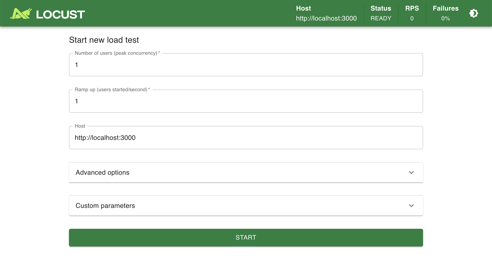

# Load Testing with Locust

This project contains load testing scripts for simulating real user behavior on our application. We use [Locust](https://locust.io/), an open-source load testing tool that allows you to define user behavior in Python code and generate realistic, concurrent traffic. It's ideal for identifying performance bottlenecks, validating scalability, and establishing performance baselines.

## Installation (MacOS 15+)

1. **Clone this repository**:

   ```bash
   git clone https://github.com/kidspassport/sawyer-load-test
   cd load-tests
   ```

2. **Install Python 3 and pip (macOS 15+)**

    Open Terminal and run:

    ```sh
    brew install python
    ```

    This will install the latest Python 3 and pip via [Homebrew](https://brew.sh/).
    If you don’t have Homebrew, install it first:

    ```sh
    /bin/bash -c "$(curl -fsSL https://raw.githubusercontent.com/Homebrew/install/HEAD/install.sh)"
    ```

    Verify installation and check Python and pip versions:

    ```sh
    python3 --version
    pip3 --version
    ```

3. **Install Locust**

    Use pip to install Locust:

    ```sh
    pip3 install locust
    ```

    Verify installation and check Locust version:

    ```sh
    locust --version
    ```

## Running Tests

### Environment Requirements
1. **Users**
    - Requires the target DB to have 1,000 `Member`s
      - username: locust_##@hisawyer.com
      - password: password123
      - must have at least 1 `Child`
    - Staging already has these users set up.  You can create them locally with this script:

    ```ruby
    [*1..1000].each do |i|
      member = Member.create(email: "locust_#{i.to_s.rjust(2, '0')}@hisawyer.com", password: "password123", confirmed_at: Time.now)
      Child.create(member:, name: "Baby Locust #{i.to_s.rjust(2, '0')}", date_of_birth: (Date.today - 5.years))
    end
    ```

2. **Providers**
    The target provider must have at least one activity with the following properties:
    - Semester
    - Current dates (or upcoming within a week or so)
    - Public (must appear on provider's "Live View"/widget)
    - Permissive age settings
    - Free Drop Ins – this is the only Pricing Configuration the script can handle.
    - Multiple activities are OK, and the test will use all of them

3. **Test Runner**
    Just run
    ```bash
    locust
    ```
    to bring up the test runner.

    

## Development

Tools available for develompent are:

- [ipython](https://pypi.org/project/ipython/)
- [flake8](https://pypi.org/project/flake8/)

### Recommended VSCode Marketplace Extensions

- [pylance](https://marketplace.visualstudio.com/items?itemName=ms-python.vscode-pylance)
- [flake8](https://marketplace.visualstudio.com/items?itemName=ms-python.flake8)
- [mypy type checker](https://marketplace.visualstudio.com/items?itemName=ms-python.mypy-type-checker)
- [autopep8 formatter](https://marketplace.visualstudio.com/items?itemName=ms-python.autopep8) -> can set `"editor.defaultFormatter": "ms-python.autopep8"` directive under python settigns
